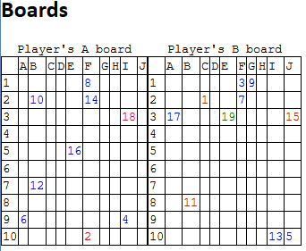

# 1st assigment

Create parser for battleships game

## Task

Format to parse from - 'bencoding w/o lists'

Implement function - move

- Finds a free spot


## Example data

Generated example preview 



```
d5:coordd1:11:E1:21:3e4:prevd5:coordd1:11:I1:21:3e4:prevd5:coordd1:11:A1:21:3e4:prevd5:coordd1:11:E1:21:5e4:prevd5:coordd1:11:J1:21:3e4:prevd5:coordd1:11:F1:21:2e4:prevd5:coordd1:11:I1:22:10e4:prevd5:coordd1:11:B1:21:7e4:prevd5:coordd1:11:B1:21:8e4:prevd5:coordd1:11:B1:21:2e4:prevd5:coordd1:11:G1:21:1e4:prevd5:coordd1:11:F1:21:1e4:prevd5:coordd1:11:F1:21:2e4:prevd5:coordd1:11:A1:21:9e4:prevd5:coordd1:11:J1:22:10e4:prevd5:coordd1:11:I1:21:9e4:prevd5:coordd1:11:F1:21:1e4:prevd5:coordd1:11:F1:22:10e4:prevd5:coordd1:11:C1:21:2ee6:result3:HITe6:result3:HITe6:result4:MISSe6:result4:MISSe6:result4:MISSe6:result4:MISSe6:result4:MISSe6:result4:MISSe6:result4:MISSe6:result4:MISSe6:result3:HITe6:result4:MISSe6:result4:MISSe6:result4:MISSe6:result3:HITe6:result4:MISSe6:result4:MISSe6:result3:HITe
```


